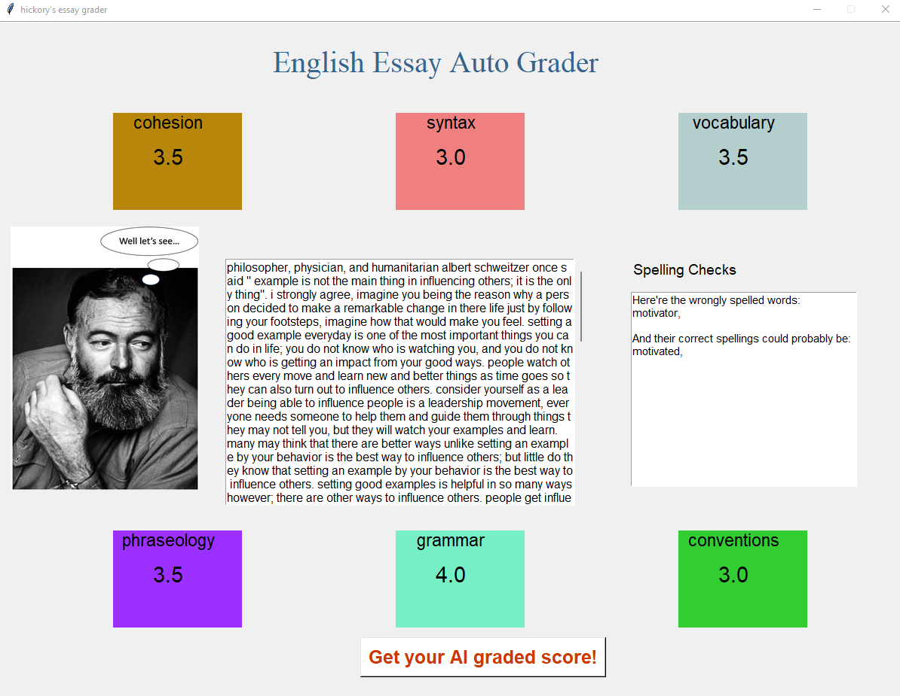

# English Language Learners Automated Essay Grader #

This project was completed as part of the Erdos Institute Fall 2022 Data Science Boot Camp. Our team members were Jai Aslam, Anirban Sharma and Zhichao Carton Zeng. We were advised by Kashif Bari. The goal of the project was to create an automated essay grader for English language learners as proposed in [this Kaggle competition](https://www.kaggle.com/competitions/feedback-prize-english-language-learning/data).

# The Problem

Effective written communication is a crucial skill across all disciplines. It requires practice to master. Unfortunately, students don't get enough opportunities to do so. Since grading written assignments is time intensive — especially when one teacher is responsible for an entire classroom — teachers often limit such assignments. This curtails students' opportunities to practice, receive feedback and develop this important skill. The problem is further exacerbated for students who are learning English as a second language, often called English language learners (ELLs), as they require more practice than others. To address this problem, we built an automated essay grader that compares the writing of ELL students to their peers. With the time saved by using an automated grader, teachers can devote more energy to tailoring assignments to their students’ needs. 

# Key Performance Indicators 

* Assigns grades to essays in 6 categories: cohesion, syntax, vocabulary, phraseology, grammar and conventions. 
* Has low error (measured in average RSME) across the categories.
* Grades an essay within a few seconds.

# Our Solution

We leveraged a pretrained BERT model to tokenize and encode our data. We then took this vectorization and used it in standard machine learning models. The most important metric for this project was the average RSME across all 6 categories. We chose the model with the lowest average RSME which turned out to be an SVM model with RBF kernel.

Models         | Cohesion     | Syntax | Vocabulary | Phraseology | Grammar | Conventions |
---------------|--------------|--------|------------|-------------|---------|-------------|
Baseline Model | 1.81         | 1.66   | 1.57       | 1.78        | 1.98    | 1.83        |
SVM Model      | 1.28         | 1.09   | 1.02       | 1.25        | 1.37    | 1.11        |
Decision Tree  | 2.49         | 2.18   | 1.92       | 2.56        | 2.68    | 2.37.       |
Random Forest  | 1.49         |
KNN            | 1.52         |
Gausian NB     | 2.99         |
Multinomial NB | 1.79         |
LSTM + CNN     | 1.49         |

